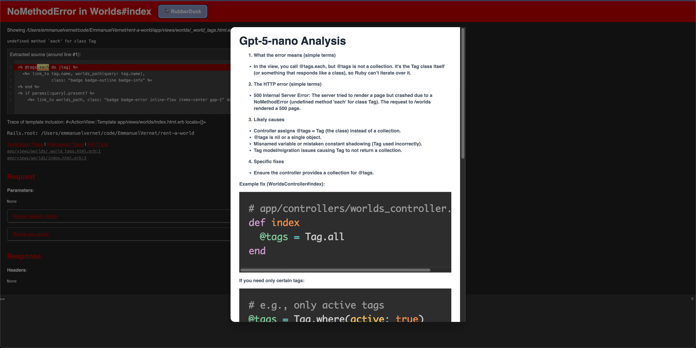

# RubberDuck 🦆

RubberDuck is a Rails engine that provides an AI-powered debugging assistant directly on your native Rails development error pages.
When an error occurs, a rubber duck button is injected into the page.
Clicking it sends error details including log lines and http error to an AI service and displays a contextualized explanation in a modal.

Here's an example of the view it can generate currently



## Usage
- this gem runs automatically when a standard rails error page shows. No rails commands needed!

> ⚠️ **Warning**
>
> Be aware that this gem uses your code and server logs to be sent to the AI model. Do not hardcode sensitive values such as tokens!!
However, the gem will not run in production, only in development

## Installation
Add this line to your application's Gemfile:

> ⚠️ **Warning**
>
> Add this to your development gems. It will not run in production environments!

```ruby
gem "rubber_duck"
```

And then execute:
```ruby
bundle install
```

Or install it yourself as:
```ruby
gem install rubber_duck
```

Run the install generator to create the initializer file:
```ruby
rails generate rubber_duck:install
```

## Configuration
Before using the gem, you need to configure your AI service API key in the initializer file located at `config/initializers/rubber_duck.rb`.
```ruby
  config/initializers/rubber_duck.rb
  RubberDuck.configure do |config|
    # Set your OpenAI API key
    config.openai_api_key = ENV['OPENAI_API_KEY']

    # (Optional) Specify a different AI model to use.
    config.model = 'gpt-4'
  end
```
Ensure you have set the `OPENAI_API_KEY` environment variable in your development environment.

## Contributing
To be determined...

## License
The gem is available as open source under the terms of the [MIT License](https://opensource.org/licenses/MIT).
